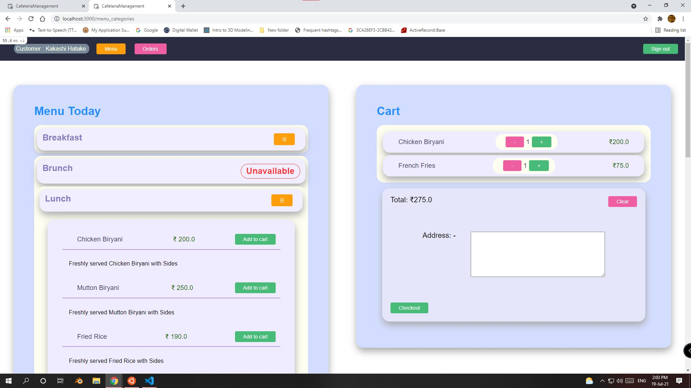

# Cafeteria Management Ruby Application

Web Application Link: - [Cafe . in](http://ramkumar-Cafeteria-Management.herokuapp.com/)

Cafeteria Management application is a fully functional web application the user was divided into 3 roll

      # Owner   email:  owner@owner.com   |  password: owner
      # Clerk   email: clerk@clerk.com    |   password:  clerk
      # customer   email: customer@customer.com       | password: customer

---

The landing page to sign up and sign in for users.

---

All the users like customer,clerk and owner are signed in through this page

---

The customers are eligible to sign up here. In other words, all users signed up here are assigned role as customers.

---

The Customers and clerk can add items from the menu to the cart and press checkout to place order.
However the clerk's orders are defined as Offline orders with walk-in customers

---

Once order is placed the page is directed to the orders list of the particular user stating the delivered and pending orders of that particular user.

---

Order details of a particular order.
a customer can only see their order invoices.
a clerk and owner can see all order invoices.

---

Order list of entire orders made in the platform.
Visible only to clerk and owner.
Both can set the pending delivery to delivered.

---

Menu view of owner where the owner can change the status of the menu, update or remove them.
Only available to owner

---

Editor for menu categories and menu items where owner can change name of catogeries, update items to it, create categories etc.

The feature is only available to owner.

The owner can select an option of category and add an item to it without filling the new/update category box

The owner can change the name of a category by selecting it in option and renaming it in the new/update category box

The owner can create a new category by simply entering the name of the category in the new/update category box

---

special account creation feature specific to owner.
Where, the owner can create accounts for clerks and other owners to login.
this functionality is not available to clerk or customer

---

Sales report with date range and income date only available to the owner.

---

# Thank You

# Project by ramkumar for web development 201 course by pupilfirst and freshworks
